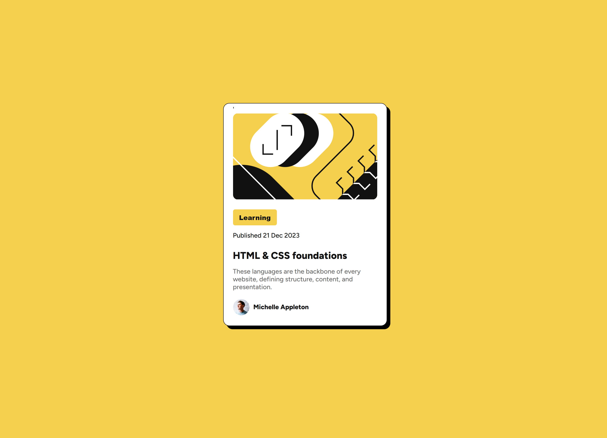

# Blog-Preview-Card

# Frontend Mentor | Blog Preview Card

This is a solution to the [Blog Preview Card challenge on Frontend Mentor](https://www.frontendmentor.io/challenges/blog-preview-card-component-2oKPsZug). Frontend Mentor challenges help you improve your coding skills by building realistic projects.

## Table of Contents

- [Overview](#overview)
  - [Screenshot](#screenshot)
  - [Links](#links)
- [My Process](#my-process)
  - [Built With](#built-with)
  - [What I Learned](#what-i-learned)
  - [Continued Development](#continued-development)
  - [Useful Resources](#useful-resources)
- [Author](#author)

## Overview

### Screenshot

### Links

- Solution URL: [Add solution URL here](https://your-solution-url.com)
- Live Site URL: [Add live site URL here](https://your-live-site-url.com)

## My Process

### Built With

- Semantic HTML5 markup
- CSS custom properties
- Flexbox
- Mobile-first workflow

### What I Learned

In this project, I learned how to create a responsive card component using HTML and CSS. I also practiced using Flexbox to center elements and create a clean layout.

### Continued Development

In future projects, I want to continue improving my CSS skills, particularly with Flexbox and Grid. I also want to learn more about responsive design and accessibility.

### Useful Resources

- [MDN Web Docs](https://developer.mozilla.org/) - This is an amazing resource for learning about HTML, CSS, and JavaScript.
- [CSS Tricks](https://css-tricks.com/) - This site has many helpful articles and tutorials on CSS.

## Author

- Frontend Mentor - [@yourusername](https://www.frontendmentor.io/profile/yourusername)
- Twitter - [@yourusername](https://www.twitter.com/yourusername)
